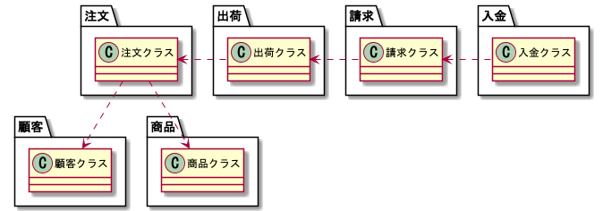
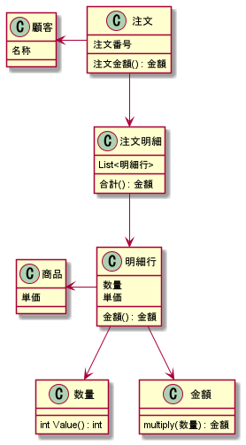
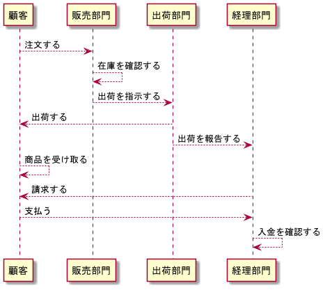
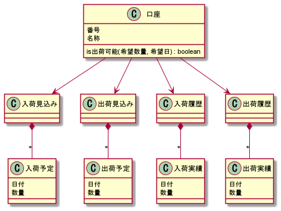
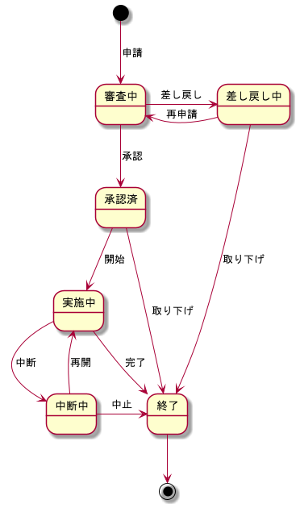

# DataAnalysisDomainModel
データ分析業務のドメインモデルを設計する。  
業務の関心事を表現するドメインオブジェクトを集めて体系的に整理したもの。  
クラス名やメソッド名は業務の用語そのもの。  
クラス名が問題領域の関心事の用語と一致している。  
メソッド名が利用者が知りたいこと/やってほしいことと一致している
用語間の関連性、相互作用をパッケージ構成やクラスの参照関係で立体的に表現する。

## ドメインモデルで設計する目的
* 業務的な判断/加工/計算のロジックを重複なく一元的に記述する
* 業務の関心事とコードを直接対応させ、どこに何が書いてあるかわかりやすく整理する
* 業務ルールの変更や追加のときに、変更の影響を狭い範囲に閉じ込める

## ドメインモデル開発にてやるべきこと
* 分析: 人間のやりたいことを正しく理解する
* 設計: 人間のやりたいことを動くソフトウェアとして実現する方法を考える

## 設計で決めること
* パッケージ構成と名前
* クラス構成と名前
* メソッド構成と名前

## クラス設計時のポイント
* メソッドをロジックの置き場所にする
* ロジックを、データを持つクラスに移動する
* 使う側のクラスにロジックを書き始めたら設計を見直す
* メソッドを短くして、ロジックの移動をやりやすくする
* メソッドでは必ずインスタンス変数を使う
* クラスが肥大化したら小さく分ける
* パッケージを使ってクラスを整理する

## 業務ロジックの例
* まずは小さい単位の業務データとロジックの関係に注目する
* 受注日と今日の日付から受注日の妥当性を判断するロジック
* 単価と数量から合計価格を計算するロジック
* 数値データの価格を千円単位の文字列に加工するロジック
* これら小さいロジックを組み合わせて、より大きな業務の関心事を表現する

## パッケージによる整理例
* クラスが増えてきたら、関心事の単位でパッケージ分けする
* パッケージの参照関係は、基本的に時間軸に沿った関係になる
* 業務の流れを逆にたどった関係


## 三層 + ドメインモデル
* プレゼンテーション層: UIなど外部との入出力を受け持つ(画面)
* アプリケーション層: 業務機能のマクロな手順の記述(進行役)
* データソース層: データベースとの入出力を受け持つ(記録と通知のしくみ)
* ドメインモデル: 業務データと関連する業務ロジックを表現したドメインオブジェクトの集合
* 各層のクラスは、業務上の判断/加工/計算のロジックをドメインオブジェクトに任せる
### アプリケーション層のクラス(サービスクラス)の役割
* プレゼンテーション層からの依頼を受ける
* 適切なドメインオブジェクトに判断/加工/計算を依頼する
* プレゼンテーション層に結果(ドメインオブジェクト)を返す
* データソース層に記録や通知の入出力を指示する
### サービスクラス設計の方針
* 業務ロジックはドメインオブジェクトに任せる
* 画面の複雑さをそのままサービスクラスに持ち込まない
* データベースの入出力の都合からサービスクラスを独立させる
* 小さく分けて、独立性の高い部品として作りながら、全体を組み立てていく
* 登録系サービスと参照系サービスに分けて考える
* 意味のある最小単位で、かつ単独でテスト可能な単位にメソッドを分割する
#### 登録系サービス
* プレゼンテーション層から渡された情報を検証
* 加工や計算を行った上で、記録したり通知する
#### 参照系サービス
* プレゼンテーション層の依頼に基づき情報を生成
* その情報をプレゼンテーション層に戻す機能
### シナリオクラス
* 基本的なサービスクラスを組み合わせた複合サービスを提供する
* アプリケーション機能の説明、シナリオテストの単位となる効果もある
* 業務の視点で必要とする機能単位をシナリオクラスで表現する

## 分析のやり方
* 業務の関心事の要点をうまく説明することが大切
* ロジックとその詳細をプログラミング言語で表現することも視野に入れる
* プログラムとしてうまく記述できる設計クラスを見つける
* クラス名やメソッド名を業務で使う用語の単位と一致させる設計をまず行う
* それだけでは整理できない部分が明らかになったら、そこに集中して、もっとうまく整理できる抽象的な概念の探索に取り組む

## ドメインモデル例
* 生年月日と年齢
* 「年齢」が業務の関心事であれば、年齢クラスを作る
* 年齢クラスは内部的に生年月日をインスタンス変数に持ち、それを使って年齢を計算するロジックをメソッドとして持つ
* 年齢を知りたい→それを計算するロジックの置き場所が必要→年齢クラスを作る
* 年齢に関するさまざまなロジックが年齢クラスに集まる
* 関心事に関連するデータとロジックをそのクラスに集めて整理することを繰り返す
* さまざまな業務ロジックの置き場所が明確になる
  

## オブジェクト指向のアプローチ
* 部分に注目する
* 個々の部品を作り始め、それを組み合わせながら、段階的に全体を作っていく
* ただし、全体的な俯瞰をいつも意識する
* パッケージ図: 個々のクラスを隠ぺいし、パッケージ単位で全体の構造を俯瞰する手段
* 分析の初期段階では、ロジックのおおよその置き場所をパッケージとして割り振ってみる
* 業務フロー図: 業務の様々な活動を、時間軸に沿って図示したもの
* 活動の主体ごとにレーンを並べて、それぞれの間での情報のやりとりを明らかにする
* クラス候補を見つけるときに、業務の流れに沿って登場するオブジェクトとして発見できる  
  
* 全体を俯瞰したら、次は重要な部分(まちがいなく必要になる部分)を探す
* 独立したプログラミング単位であるドメインオブジェクトを、重要な順に開発していく

## 独立した部品を組み合わせて機能を実現する
* 独立したドメインオブジェクトを組み合わせて、業務の機能を実現する
* アプリケーション層のクラスの役割
* 機能の分解構造や時間的な依存関係を持ち込まないように、ドメインオブジェクトを設計する
* そのオブジェクトが、どの業務機能のどこで使われるかがはっきりしなくても良い
* 最初から網羅的にオブジェクトを見つけることはできない
* 足りないものは、機能を組み立てていく過程で明らかになる
* 不足しているオブジェクトを見つけながらモデルに追加していく

## 業務の関心事を分類する
### ヒト
* 業務活動の当事者
* 意思、判断、行動についてデータを持る
* そのデータを使った判断、加工、計算のロジックを持つ
### モノ
* ヒトが業務を遂行するときの関心の対象
* 数量、金額、率、説明、注釈、状態、日月や期間、位置
* これらを表現するデータと、それらに対して業務的にどういう判断、加工、計算をしたいかをロジックとして持つ
### コト
* 業務的に起きてほしいコト、起きてはいけないこと
* 業務アプリケーションの関心事は、コトを記録し、コトの発生を通知すること
* ヒトの意思決定や行動の結果
* 何について発生したか、どういう種類か、いつ起きたのか
* 起きた事象が業務的に起きてよいことかの判断、起きた場合に何をすべきかの判断
### コトに注目して整理する
* コトは時系列に整理しやすいため、全体の基本的な流れや重要な前後関係が明確になる
* 販売活動を例に時間軸に沿った一連の出来事の発生
* これらを適切に進めるのがアプリケーションの役目
* 受注
* 出荷
* 請求
* 入金
#### 受注
* 受注内容の妥当性を確認する必要がある
* 在庫はあるか、限度額を超えてないか、自社の販売方針に違反してないか
* 注文数量や受注金額についての判断/加工/計算の業務ロジックが必要
* このデータとロジックをドメインオブジェクトにまとめる
#### 数量
* 数量に関するロジックは、数量クラスにまとめられる
* 数量単位クラス、販売可能数量クラス
* これらを数量パッケージにまとめる
* 部品を特定し、その部品ごとに独立したクラスを設計する
#### 期待されること、されないこと
* 期待されたとおりの内容か判断する
* 期待されていた場合の次のアクション
* 期待されていなかった場合のアクション
* 予定クラス、実績クラス、差異クラス
### 業務ロジックの実体
* 数値の一致や大小比較
* 日付の一致や前後比較
* 文字列の一致、不一致の判定
* これらの判断のもとになるデータとロジックごとにオブジェクトを生成
* それぞれは自分で判断ができる、これらを適切に組み合わせる、if文に入れ子にしない
* 各オブジェクトが持つデータは1つか2つ
* ルールの追加は、判断のもとになるデータを持つオブジェクトの判断ロジックを追加する

## ドメインオブジェクトの基本設計パターン
### 数値オブジェクト
* 数値、日付、文字列をラッピングしてロジックを整理する
### コレクションオブジェクト
* 配列やコレクションをラッピングしてロジックを整理する
### 区分オブジェクト
* 区分の定義と区分ごとのロジックを整理する
### 列挙型の集合操作
* 状態遷移ルールなどを列挙型の集合として整理する

## 業務の関心事のパターン
### 口座パターン
* 現在の値を表現し、妥当性を管理する
* 関心の対象を口座として用意する
* 数値の増減の予定を記録する
* 数値の増減の実績を記録する
* 現在の口座の残高を算出する
  
* 実際には、データベースの記録やSQLを使った問い合わせと、メモリ上のオブジェクトが実行するロジックを組み合わせる
### 期日パターン
* 約束を実行すべき期限を設定する
* その期限までに約束が適切に実行されることを監視する
* 期限切れの危険性について事前に通知する
* 期限までに実行されなかったことを検知する
* 期限切れの程度を判断する
```java
class DueDate {
    LocalDate dueDate;
    
    boolean isExpired() {
        // 期限切れか
    }
    
    boolean isExpiredOn(LocalDate date) {
        // その日は期限切れか    
    }
    
    int remainingDays() {
        // 期限までの日数
    }
    
    AlertType alertPriority() {
        // 期限切れの警告度合いの判定
    }
}
```
* 出荷期日と支払い期日ろいうルールがなるならクラスを分ける
* 本当の共通ロジックは、DueDateクラスを2つのクラスから部品として使う
* if文で書き分けるような設計になるなら分ける

### 方針パターン
* 複合したルールを扱うための方法
* ルールの集合を持ったコレクションオブジェクトを作る
```java
class Policy {
    Set<Rule> rules;
    
    boolean complyWithAll(Value value) {
        for (Rule each : rules) {
            if (each.ng(value)) return false;
        }
        return true; // 全てのルールに適合
    }

    boolean complyWithSome(Value value) {
        for (Rule each : rules) {
            if (each.ok(value)) return true;
        }
        return false; // どのルールにも適合しない
    }
    
    void addRule(Rule rule) {
        rules.add(rule);
    }
    
    interface Rule {
        boolean ok(Value value);
        
        default boolean ng(Value value) {
            return ! ok(value);
        }
    }
}
```
* 一つ一つのルールごとに、Ruleインターフェースを持ったオブジェクトを作る

### 状態パターン
* 状態遷移の例  
  
* ある状態が遷移できる次の状態には制限がある
* 列挙型を使うと、これをif文/switch文を使わずに表現できる
* 状態の列挙
```java
enum State {
    審査中,
    承認済,
    実施中,
    終了,
    差し戻し中,
    中断中
}
```
* 状態の一覧や部分集合の扱い方
```java
State[] states = State.values(); // 状態の一覧
Set nextStates = EnumSet.of(承認済, 差し戻し中); // 状態のグルーピング
```
* ある状態から遷移可能な状態(複数)をSetで宣言する
* 遷移元の状態をキーに、遷移可能な状態のSetを値にしたMapを宣言する
* from状態からto状態へ遷移可能かどうかを判定する
* 状態遷移図のような視覚的な表現を使った分析活動と、
* 列挙型という実装のしくみを直接敵に関連づけて、
* 分析と設計を進める